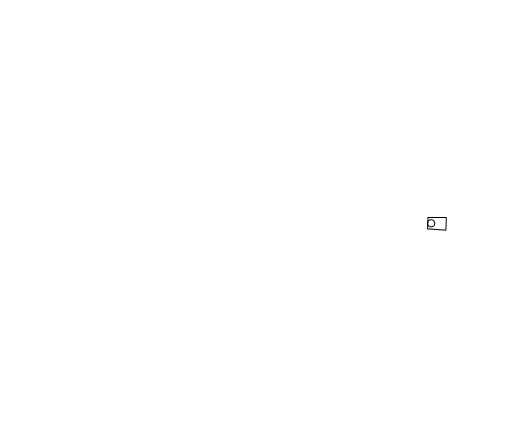

```{r setup, include=FALSE}

knitr::opts_chunk$set(echo = T, warning = F, message= F)

```

# Loading necessary libraries

```{r}

library(ggpubr)
library(gprofiler2)
library(tidyverse)
library(readxl)

```

# Check your working directory
- Paths provided within this .rmd assume you are working within the `Hackathon19_visualise_ontology` project directory. Provided you have opened `Hackathon19_visualise_ontology` as a project this should already be the case.
- You can check by doing the following:

```{r}

getwd()

```

# Running gProfiler2
- Input genes are sourced from the latest [PD GWAS](https://www.biorxiv.org/content/10.1101/388165v3).
- We will be using two lists:
    - Nearest nominated gene
    - QTL nominated gene
```{r}

# import PD GWAS table
PD_res <-
  readxl::read_excel(path = "./data/TableS2_Detailed_summary_statistics_nominated_risk_variants.xlsx")

# Creating a named list
geneLists <- 
  PD_res %>% 
  # Select two columns we wish to turn into lists
  dplyr::select(`Nearest Gene`, `QTL Nominated Gene (nearest QTL)`) %>% 
  # Coerce columns into list format
  as.list() %>% 
  # Across each list do the following...
  lapply(., function(x){
    x %>% 
      # Remove NAs
      na.omit() %>%
      # Convert to character vector
      as.character() %>% 
      # Keep only unique genes
      unique()
  }) %>% 
  # Name the lists
  setNames(., c("nearest_gene", "QTL_nom_gene"))


# running gprofiler
gprofilerOutput <- gprofiler2::gost(query = geneLists, # if lists are named then gost can use this an input
                               organism = "hsapiens", # set the organism 
                               correction_method = c("gSCS"), # select a correction method (gSCS reccomended in gost documentation)
                               domain_scope = c("annotated"), # select whether to restrict the background set
                               sources = c("GO"), # databases would you like to search for pathways & processes (others: "KEGG","REAC","WP")
                               significant = TRUE, # when TRUE displays only significant results (p<0.05)
                               evcodes = TRUE, # when TRUE displays the IDs of the genes calling each pathway
                               ordered_query = FALSE) # when TRUE the input list is ordered in some meaningful way


```

- The background list (`domain_scope` argument) is an important choice, as it should represent the population of genes your list was sampled from. E.g. If you were to perform a differential gene expression experiment in brain samples from control and PD, your background list would be all the expressed genes you tested.
    - `gprofiler2::gost` provides 3 different options: "annotated", "known", "custom". For more details see: https://biit.cs.ut.ee/gprofiler/page/docs#statistical_domain_scope
    
# What do the results mean?
```{r}

gprofilerOutput$result %>% 
  DT::datatable(rownames = FALSE,
                options = list(scrollX = TRUE),
                class = 'white-space: nowrap')

```

- Notice that one of the columns is `query`, and within this we find the names of our inputted lists i.e. `r gprofilerOutput$result %>% .[["query"]] %>% unique()`
- gprofiler outputs a number of columns, a few of which are not entirely self-explanatory, including:
    - precision: this is the proportion of genes in the input gene list that can be assigned this term i.e. overlap.size/query.size
    - recall: this is the proportion of genes in the input list that overlap with the term i.e. overlap.size/term.size
    - parents: GO terms belong to families of terms. This column will provide the parent terms to the GO term found enriched.
- Also, as some of you may notice there are some duplicated terms between our two lists, which are shown in the table below.
```{r}

gprofilerOutput$result %>% 
  # Filter for duplicated terms
  dplyr::filter(duplicated(term_id) | duplicated(term_id, fromLast = TRUE)) %>% 
  # Rearrange column order to have term_id and term_name at beginning
  dplyr::select(term_id,term_name, everything()) %>% 
  # Arrange rows by term_id
  dplyr::arrange(term_id) %>% 
  DT::datatable(rownames = FALSE,
                options = list(scrollX = TRUE),
                class = 'white-space: nowrap')

```

# How to visualise this information?
- There are many ways to visualise these results, with a few examples given below.
- How do you think this information would be best displayed? **This is what we're going to do over the next few days.**

# Visualising the results as a barplot  
- Remember we queried two lists, so we will want to plot this twice
```{r, fig.height=8}

source("./R/gen_gprofiler_barplot.R")

plot_list <- 
  gprofilerOutput$result %>% 
  # Group by query
  dplyr::group_by(query) %>% 
  # Split dataframe by query groups i.e. nearest_gene and QTL_nom_gene
  dplyr::group_split() %>%
  # For each dataframe plot a barplot
  lapply(., function(x){
    gen_gprofiler_barplot(DF = x,
                          num_categories = 15,
                          plot_title = "")
  })

# ggarrange allows us to arrange multiple ggplots on the same page
ggpubr::ggarrange(plotlist = plot_list,
                  labels = c("nearest_gene", "QTL_nom_gene"),
                  nrow = 2)  


```

# Visualising the results with gprofiler's in-built visualisation

```{r}

gprofiler2::gostplot(gprofilerOutput) 

```

# Visualising as a network?
- Nodes would represent GO terms and edges the genes shared between these GO terms
- Potential packages:
    - [ggraph](https://github.com/thomasp85/ggraph)
    - [ggnetwork](https://github.com/briatte/ggnetwork)
    - [geom_net](https://github.com/sctyner/geomnet)
    
# Visualise as circular plot

## First attempt


## Starting the circle
```{r, fig.height=9, fig.width=9}

# Save results with a column denoting an x-value between the range 1-2
results <- gprofilerOutput$result %>% 
  dplyr::mutate(x = 1.5)

# Need to create a duplicate table wherein a range (xmin, xmax) is created for each term
results_dup <- results %>% 
  dplyr::select(-x) %>% 
  dplyr::inner_join(results %>% 
                      dplyr::distinct(term_id) %>% 
                      dplyr::mutate(xmin = 1,
                                    xmax = 2) %>% 
                      tidyr::gather(key = x_value, value = x, -term_id) %>% 
                      dplyr::select(-x_value))


# Initialising first circle with points
library(circlize)
circos.par("track.height" = 0.1)
circos.initialize(factors = results_dup$term_id, x = results_dup$x)

circos.track(factors = results$term_id, x = results$x, y = results$precision,
             panel.fun = function(x, y) {
               circos.points(x,y)
             })

# Adding text to circle
library(circlize)
circos.par("track.height" = 0.1)
circos.initialize(factors = results_dup$term_id, x = results_dup$x)

circos.track(factors = results$term_id, x = results$x, y = results$precision,
             panel.fun = function(x, y) {
               circos.points(x,y)
               labels = get.cell.meta.data("sector.index")
               xlim = get.cell.meta.data("xlim")
               ylim = get.cell.meta.data("ylim")
               circos.text(x = mean(xlim), y = 0.9, 
                           labels = labels, 
                           cex = 0.5, 
                           facing = "clockwise", 
                           niceFacing = TRUE)
             })

# Moving text in circle
library(circlize)
circos.par("track.height" = 0.1)
circos.initialize(factors = results_dup$term_id, x = results_dup$x)

circos.track(factors = results$term_id, x = results$x, y = results$precision,
             panel.fun = function(x, y) {
               circos.points(x,y)
               labels = get.cell.meta.data("sector.index")
               xlim = get.cell.meta.data("xlim")
               ylim = get.cell.meta.data("ylim")
               circos.text(x = mean(xlim), y = 2, 
                           labels = labels, 
                           cex = 0.75, 
                           facing = "clockwise", 
                           niceFacing = TRUE)
             })


```


## Chord diagram
- We decided to start from the `chordDiagram()` function as opposed to building our own tracks from scratch
- This required creating:
    - A function to find the genes that intersect between GO enrichments
    - A function to plot the chordDiagram and add a rotated text track
```{r}

get_intersections <- function(gprofiler_results, term_id_or_name = c("id", "name")){
  
  if(term_id_or_name == "id"){
    
    intersect_df <- data.frame(term_id_1 = gprofiler_results$term_id %>% unique() %>% as.character(),
                               term_id_2 = gprofiler_results$term_id %>% unique() %>% as.character()) %>% 
      tidyr::expand(term_id_1, term_id_2) %>%  
      dplyr::mutate(term_id_1 = term_id_1 %>% as.character(),
                    term_id_2 = term_id_2 %>% as.character()) %>% 
      dplyr::filter(term_id_1 < term_id_2) %>% 
      dplyr::inner_join(gprofiler_results %>% 
                          dplyr::select(term_id, intersection), by = c("term_id_1" = "term_id")) %>% 
      dplyr::inner_join(gprofiler_results %>% 
                          dplyr::select(term_id, intersection), by = c("term_id_2" = "term_id")) %>% 
      dplyr::mutate(intersection.x = intersection.x %>% 
                      str_split(., ","),
                    intersection.y = intersection.y %>% 
                      str_split(., ","),
                    intersection_of_x_and_y = Map(intersect, intersection.x, intersection.y),
                    number_of_intersections = Map(length, intersection_of_x_and_y) %>% 
                      unlist()) %>% 
      dplyr::distinct(term_id_1, term_id_2, .keep_all = TRUE) %>% 
      dplyr::mutate(from = term_id_1,
                    to = term_id_2,
                    value = as.numeric(number_of_intersections)) %>% 
      dplyr::select(from,to,value)
    
  } 
  
  if(term_id_or_name == "name"){
    
    intersect_df <- data.frame(term_name_1 = gprofiler_results$term_name %>% unique() %>% as.character(),
                               term_name_2 = gprofiler_results$term_name %>% unique() %>% as.character()) %>% 
      tidyr::expand(term_name_1, term_name_2) %>%  
      dplyr::mutate(term_name_1 = term_name_1 %>% as.character(),
                    term_name_2 = term_name_2 %>% as.character()) %>% 
      dplyr::filter(term_name_1 < term_name_2) %>% 
      dplyr::inner_join(gprofiler_results %>% 
                          dplyr::select(term_name, intersection), by = c("term_name_1" = "term_name")) %>% 
      dplyr::inner_join(gprofiler_results %>% 
                          dplyr::select(term_name, intersection), by = c("term_name_2" = "term_name")) %>% 
      dplyr::mutate(intersection.x = intersection.x %>% 
                      str_split(., ","),
                    intersection.y = intersection.y %>% 
                      str_split(., ","),
                    intersection_of_x_and_y = Map(intersect, intersection.x, intersection.y),
                    number_of_intersections = Map(length, intersection_of_x_and_y) %>% 
                      unlist()) %>% 
      dplyr::distinct(term_name_1, term_name_2, .keep_all = TRUE) %>% 
      dplyr::mutate(from = term_name_1,
                    to = term_name_2,
                    value = as.numeric(number_of_intersections)) %>% 
      dplyr::select(from,to,value)
    
  }
  
  return(as.data.frame(intersect_df))
  
}

chord_diagram_function <- function(chord_results){
  mat <- chord_results %>% 
    dplyr::mutate(from = str_wrap(from, width = 20),
                to = str_wrap(to, width = 20))
  
  set.seed(1234)
  grid.col <- setNames(rainbow(length(unlist(dimnames(mat)))), union(rownames(mat), colnames(mat)))
  par(mar = c(0, 0, 0, 0), mfrow = c(1, 1))
  
  
  # now, the image with rotated labels
  chordDiagram(mat, annotationTrack = "grid", preAllocateTracks = 1, grid.col = grid.col)
  circos.trackPlotRegion(track.index = 1, panel.fun = function(x, y) {
    xlim = get.cell.meta.data("xlim")
    ylim = get.cell.meta.data("ylim")
    sector.name = get.cell.meta.data("sector.index")
    circos.text(mean(xlim), ylim[1] + .1, cex = 0.75, sector.name, facing = "clockwise", niceFacing = TRUE, adj = c(0, 0.5))
    circos.axis(h = "top", labels.cex = 0.5, major.tick.percentage = 0.2, sector.index = sector.name, track.index = 2)
  }, bg.border = NA)
}

```

- We can now plot our diagram.
```{r, fig.height= 12, fig.width=12}

chord_results <- get_intersections(gprofiler_results = gprofilerOutput$result %>% 
                                     dplyr::filter(query == "QTL_nom_gene",
                                                   term_size > 20,
                                                   term_size < 2000), 
                                   term_id_or_name = "name") 

chord_diagram_function(chord_results = chord_results %>% 
                         dplyr::filter(value > 10))

```

# Session info
- It is considered good practice to always your session info in the html output of an R markdown.
- Session info will depend on the RStudio you are using, your operating system and the packages you load. Thus, when you knit the final product of your code, it may not look like it does in this version of the html output. 
```{r session info}

sessionInfo()

```

